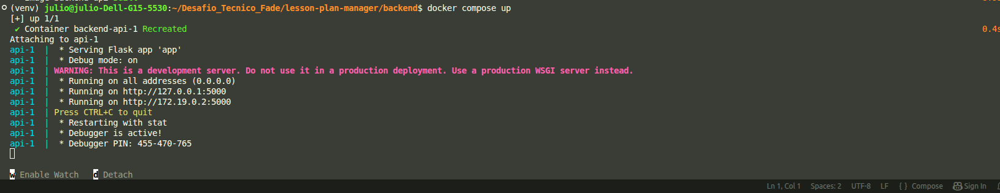
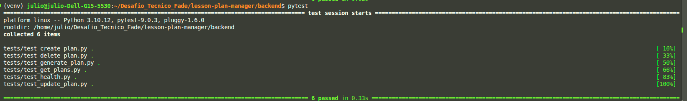
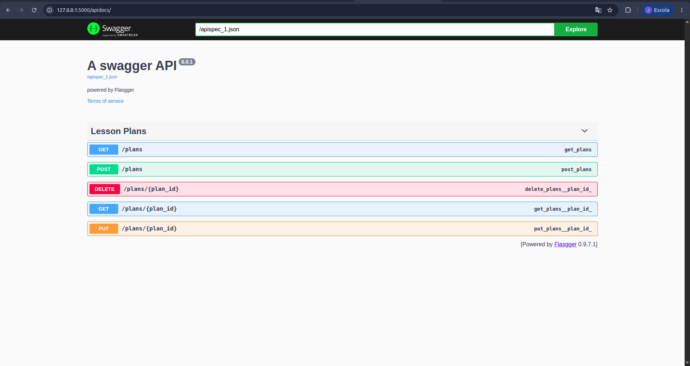
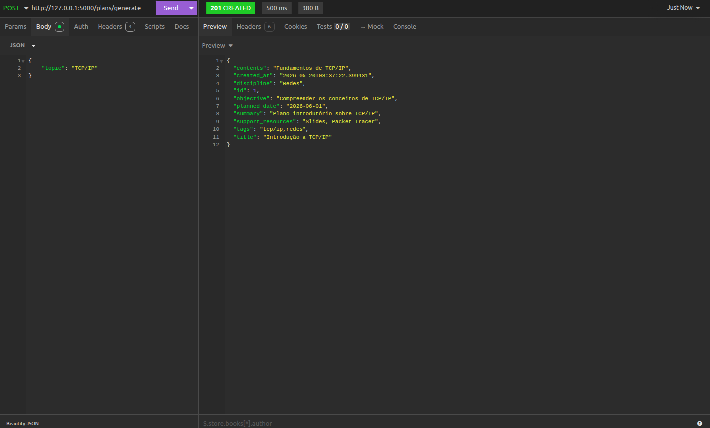
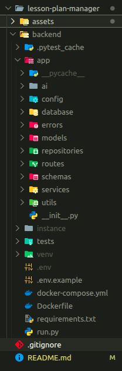

# Lesson Plan Manager API

API REST desenvolvida com Flask para gerenciamento de planos de aula, incluindo CRUD completo, integração com IA, testes automatizados, documentação Swagger e containerização com Docker.

---

# Funcionalidades

- CRUD completo de planos de aula
- Geração automática de planos com IA
- Persistência com SQLite
- Documentação interativa com Swagger
- Testes automatizados com Pytest
- Containerização com Docker
- Arquitetura organizada em camadas
- Tratamento básico de erros
- Fallback mockado para IA

---

# Tecnologias Utilizadas

- Python
- Flask
- SQLAlchemy
- SQLite
- Pytest
- Docker
- Swagger / Flasgger
- OpenRouter API

---

# Estrutura do Projeto

```txt
backend/
│
├── app/
│   ├── ai/
│   ├── config/
│   ├── database/
│   ├── errors/
│   ├── models/
│   ├── repositories/
│   ├── routes/
│   └── services/
│
├── tests/
├── assets/
│
├── .env.example
├── .gitignore
├── docker-compose.yml
├── Dockerfile
├── README.md
├── requirements.txt
└── run.py
```

---

# Instalação

## Clonar repositório

```bash
git clone <url_do_repositorio>
cd lesson-plan-manager/backend
```

---

## Criar ambiente virtual

### Linux

```bash
python -m venv venv
source venv/bin/activate
```

### Windows

```bash
python -m venv venv
venv\Scripts\activate
```

---

## Instalar dependências

```bash
pip install -r requirements.txt
```

---

# Variáveis de Ambiente

Crie um arquivo `.env`:

```env
DATABASE_URL=sqlite:///lesson_plans.db
OPENROUTER_API_KEY=sua_chave
```

---

# Executando o Projeto

```bash
python run.py
```

A API ficará disponível em:

```txt
http://127.0.0.1:5000
```

Swagger:

```txt
http://127.0.0.1:5000/apidocs
```

---

# Containerização com Docker

O projeto foi containerizado utilizando Docker e Docker Compose, permitindo execução padronizada do ambiente e facilitando desenvolvimento e deploy.

## Build dos containers

```bash
docker compose build
```

---

## Executar aplicação

```bash
docker compose up
```

---

## Docker em execução



---

# Testes Automatizados

Os testes automatizados foram desenvolvidos utilizando Pytest para validar os principais fluxos da aplicação.

## Executar testes

```bash
pytest
```

---

## Resultado dos testes



---

# Endpoints Principais

## Health Check

```http
GET /health
```

---

## Criar plano de aula

```http
POST /plans
```

---

## Buscar todos os planos

```http
GET /plans
```

---

## Buscar plano por ID

```http
GET /plans/<id>
```

---

## Atualizar plano

```http
PUT /plans/<id>
```

---

## Remover plano

```http
DELETE /plans/<id>
```

---

## Gerar plano automaticamente com IA

```http
POST /plans/generate
```

### Exemplo

```json
{
    "topic": "TCP/IP"
}
```

---

# Demonstração

## Swagger

A documentação da API foi desenvolvida utilizando Swagger.



---

## Integração com IA

A aplicação possui integração com provedores LLM via OpenRouter API para geração automática de planos de aula.

Também foi implementado um sistema de fallback mockado para funcionamento em casos de indisponibilidade da IA externa.



---

## Estrutura do Projeto

Organização baseada em arquitetura em camadas para separação de responsabilidades e melhor manutenção do sistema.



---

# Observações

Devido a incompatibilidades relacionadas ao ambiente gráfico Linux/NVIDIA durante a gravação da demonstração em vídeo, a apresentação do funcionamento do sistema foi documentada através de screenshots reais da aplicação em execução.

---

# Melhorias Futuras

- Autenticação JWT
- PostgreSQL
- Deploy em nuvem
- Paginação
- Cache
- Rate limiting
- Tasks assíncronas

---

# Autor

Júlio César Barbosa da Silva